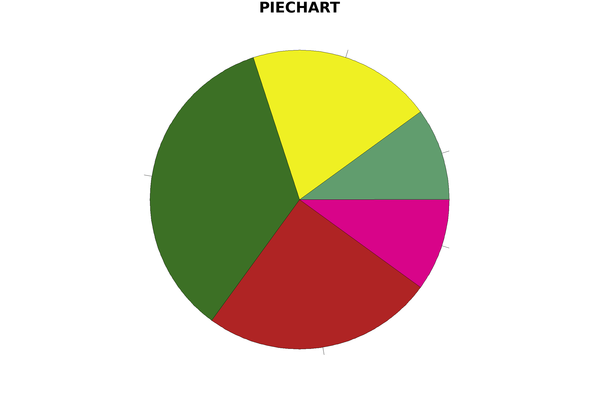

# Generateur de Pie Chart

Ce projet contient un programme en C qui génère un graphique de type Pie Chart (ou camembert en français). 

Le code utilise la bibliothèque GD pour générer le graphique et il peut générer des graphiques avec des pourcentages et des étiquettes spécifiés par l'utilisateur.

## Installation

Assurez-vous que vous avez les bibliothèques gd et math.h installées sur votre système pour compiler et exécuter le programme.

Pour compiler le programme, utilisez la commande gcc:

```bash
gcc -o pie_chart pie_chart.c -lgd -lm
```

## Utilisation

Pour utiliser le programme, vous devrez fournir quatre arguments sur la ligne de commande:

1. Le nom du fichier de sortie (par exemple, output.png)
2. Les pourcentages pour chaque segment du diagramme circulaire, séparés par des espaces (par exemple, 20 30 50)
3. Les étiquettes pour chaque segment, également séparées par des espaces (par exemple, Segment1 Segment2 Segment3)
4. Le titre du graphique, s'il est souhaité, sera placé en fin d'argument avec `--titre` ou `-T`.

Voici un exemple d'utilisation :

```bash
./PieChart output.png 10 25 35 20 10 Segment1 Segment2 Segment3 Segment4 Segment5 --titre graphique
```


On peut également générer un graphique juste avec les valeurs numériques (y compris les décimales):

```bash
./PieChart 10 25 35 20 10 
```



## Licence

Ce projet est sous licence MIT. Voir le fichier LICENSE pour plus de détails.

## Auteur

Antony Coco

Pour toute question ou demande de support, veuillez ouvrir un ticket dans l'onglet "Issues" de ce dépôt.
